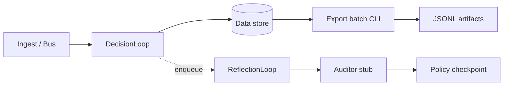

# Architecture overview

This document is written for engineers reviewing the RADA repository — what the system does, how pieces connect, and where extension points live.

## Problem statement

RADA turns normalized market events into persisted, auditable decisions under explicit risk constraints. Downstream training and reflection consume **exported** artifacts; training does not run on the hot path.

## Control flow

### DecisionLoop (hot path)

1. **Reasoner** produces a `DecisionTrace`.
2. **Policy** proposes an action.
3. **SearchLoop** (optional, `RADA_SEARCH_ENABLED`) may refine the proposal via MCTS + CVaR selection.
4. **Risk optimizer** adjusts size / CVaR metadata.
5. **Data store** persists the `Decision`.

Implementation: `src/rada/core/decision_loop.py`

### ReflectionLoop (async, off hot path)

Completed decisions are enqueued without blocking `process_one`. A consumer runs auditor scoring and updates a policy checkpoint stub.

Implementation: `src/rada/core/reflection_loop.py`

### Data platform (usage vs export)

| Mode | Config | Runner |
|------|--------|--------|
| `usage` | `configs/data/usage.yaml` | `UsagePipelineRunner` |
| `export` | `configs/data/export.yaml` | `ExportPipelineRunner` |

Export cards: `DecisionExportRow`, `FeedbackRecord` under `src/rada/data/cards/`.

Batch CLI: `scripts/export_reflection.py` → `exports/reflection/` and `feedback/outgoing/`.

## Search layer

Fixture-driven evaluation (`benchmarks/search/`) measures regret, CVaR breach rate, and faithfulness — not live PnL.

Modules: simulation → vectorized env → game theory / MCTS → `risk_selection` → `eval`.

## Observability

- In-process counters: `src/rada/utils/metrics.py`
- HTTP: `/health`, `/metrics`
- Optional Prometheus/Grafana: `docker-compose.monitoring.yml`

## Extension points

| Interface | File |
|-----------|------|
| Reasoner | `interfaces/reasoner.py` |
| Policy | `interfaces/policy.py` |
| Risk | `interfaces/risk.py` |
| Auditor | `interfaces/auditor.py` |
| Storage | `interfaces/data_store.py` |

Swap implementations without changing orchestration code.

## Related

- [data-platform.md](./data-platform.md)
- [search-algorithms.md](./search-algorithms.md)
- [decisions.md](./decisions.md)
